# Práctica 00. Iniciación a JavaScript

## Objetivos

En esta práctica he preparado el repositorio del módulo y he tenido una primera toma de contacto con JavaScript.

## Ejercicio 1. Mi primer programa

En este ejercicio lo primero que he hecho ha sido abrir el Visual Studio Code y poner `console.log` que se utiliza para mostrar un mensaje, seguidamente lo he ejecutado en la terminal.

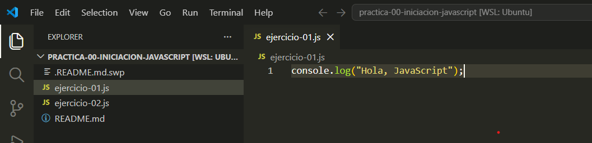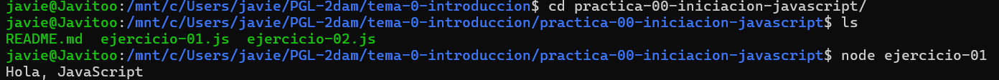

Despues he añadido otros dos `console.log` para mostrar más mensajes.

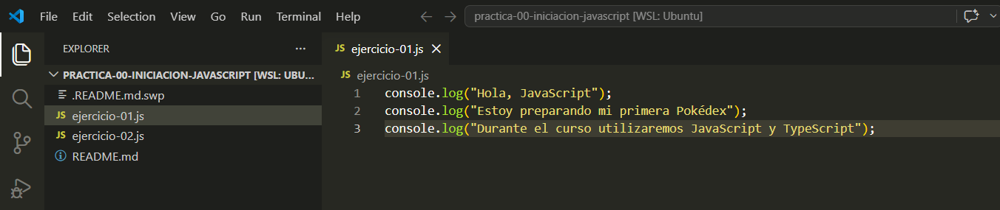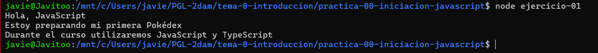

En el siguiente paso he creado unas variables que nos permiten guardar un dato para utilizarlo después más adelante.

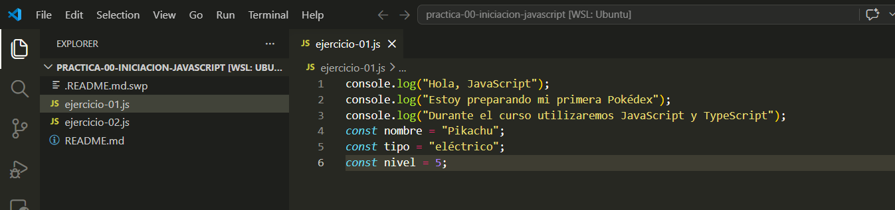

Ahora pues podemos poner dentro de los `console.log` las variables que hemos puesto antes para mostrarlas.

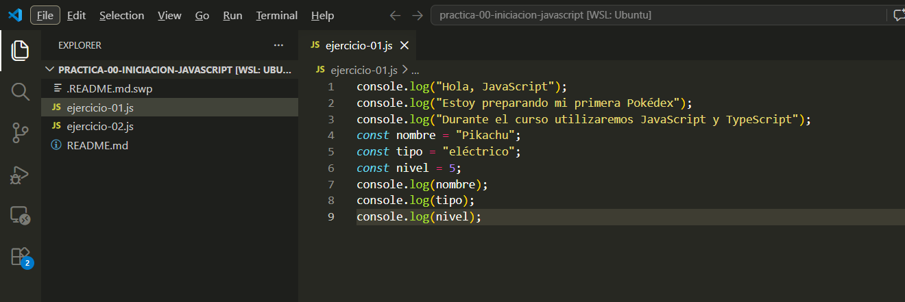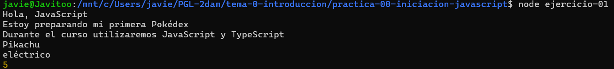

También podemos construir una frase usando estas variables como se puede ver en la captura.

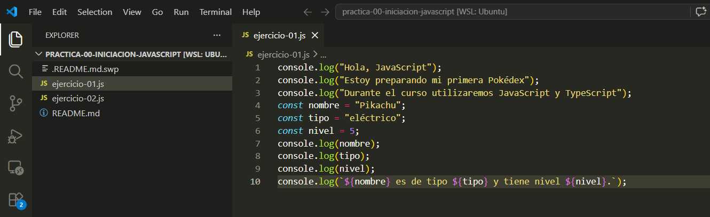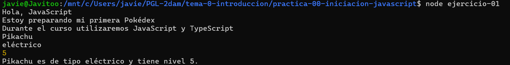

Y ahora en el momento que cambiemos el valor de las variables pues cambiará el resultado.

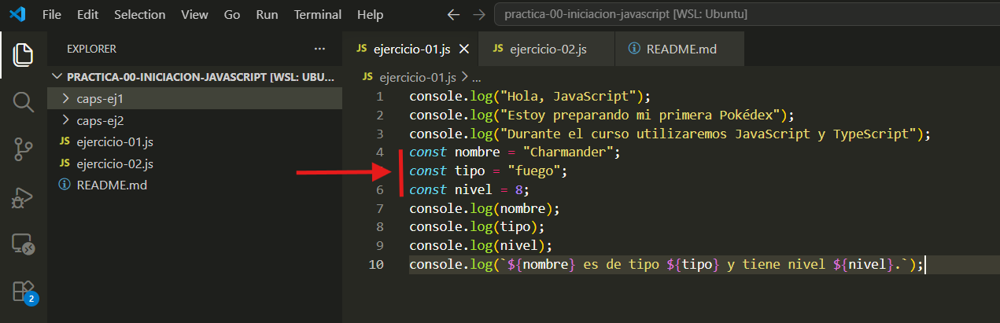

## Ejercicio 2. Operaciones básicas

En este ejercicio primero se declaran unas variables las cuales después se utilizan para hacer una operación que consiste
en sumar la `experienciaActual` con la `experienciaGanada` para que dé otra variable que se llame `experienciaTotal`.

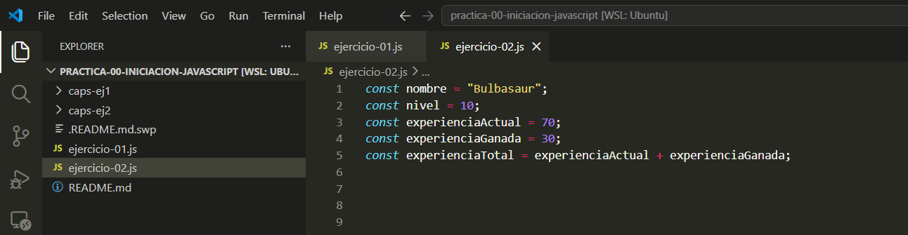

Seguidamente muestra unas frases contruídas con esas variables.

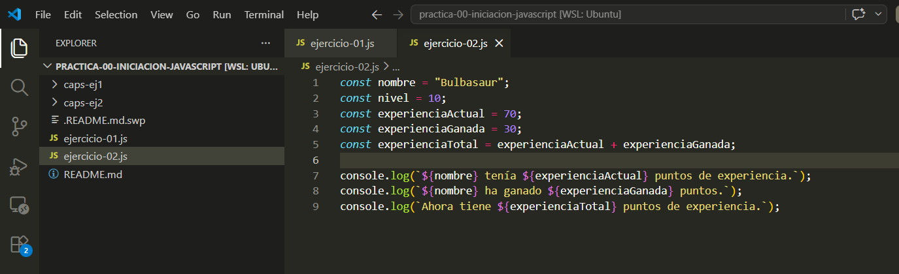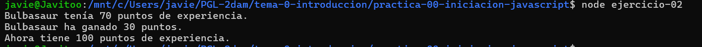

Y por último hay una ultima parte que es un `if` que lo que hace es que si su `experienciaTotal` es mayor o igual a 100
puede subir de nivel, y si es menor pues todavía no podrá subir de nivel.

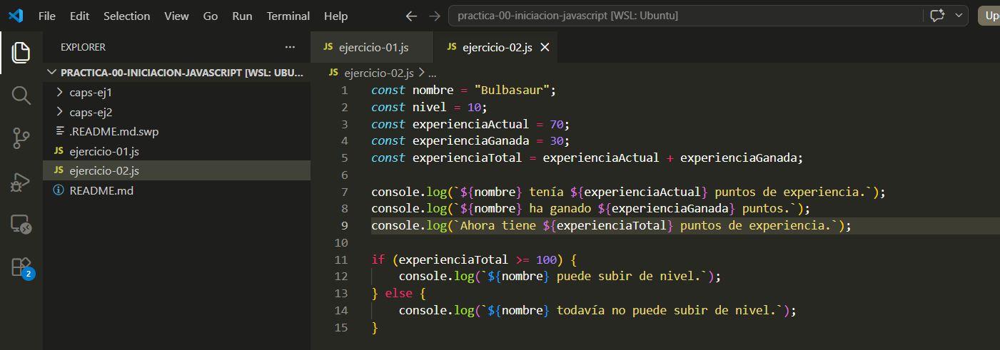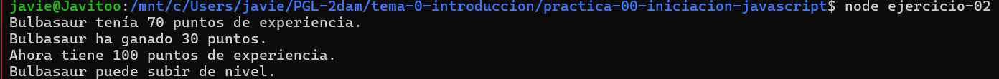

Y ahora lo podemos comprobar que si se le pone un número menor que 100 en la `experienciaTotal` pues no podrá subir de nivel.

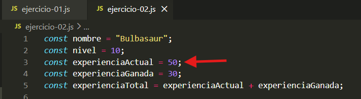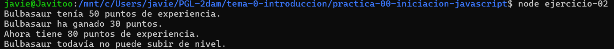

## Conceptos utilizados

- `console.log()`: muestra en la consola lo que contenga
- Variable: nos permite guardar valores para usarlos mas adelante sin tener que estar repitiendo el valor en todos lados
- Texto: elemento que usamos como valor para variables o formar frases para usar las variables
- Número: elemento que usamos también como variable
- Condición: muy importante ya que hace que se pueda subir de nivel o no

## Dificultades encontradas

En estos ejercicios no he tenido ninguna dificultad

## Conclusión

Pues estos ejercicios están bastante bien, sobretodo para poder refrescar cosas de javaScript y algunas cosas también
de git como por ejemplo el MarkDown.
